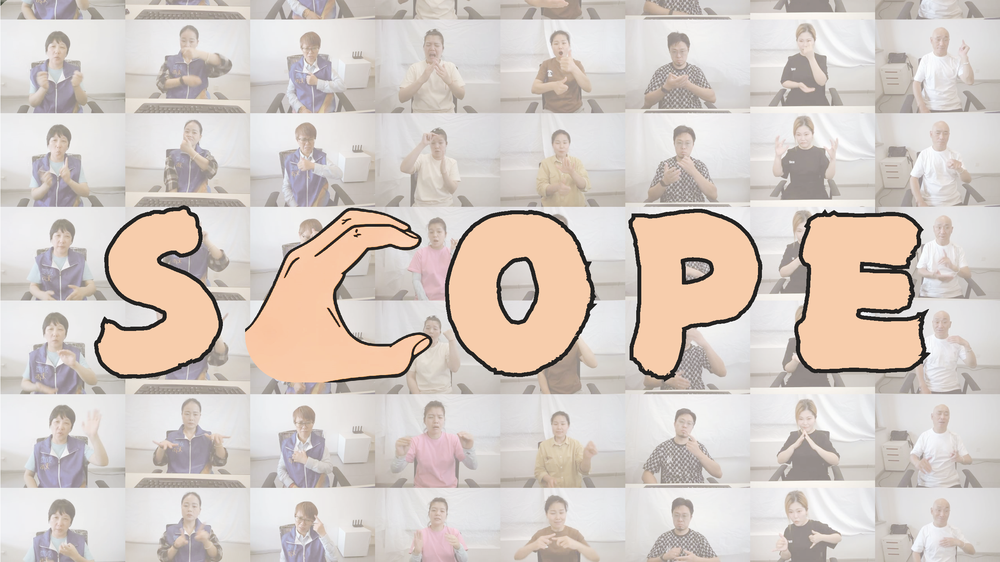

# SCOPE
The official implementation of the paper "[SCOPE: Sign Language Contextual Processing with Embedding from LLMs](https://arxiv.org/abs/2409.01073)".



For more results and details, please visit our webpage (comming soon).

If you are interested in our dataset, please apply here (comming soon).
# SCOPE Dataset
| Dataset        | Language | Videos | Duration(h) | Signers | Vocab          | Gloss     | Text     | Dialogue | Source |
|----------------|----------|--------|-------------|---------|----------------|-----------|----------|----------|--------|
| PHOENIX-2014   | DGS      | 6,841  | 8.9         | 9       | 1k (German)    | ✔️        | ✖️       | ✖️       | TV     |
| PHOENIX-2014T  | DGS      | 8,257  | 11          | 9       | 3k (German)    | ✔️        | ✔️       | ✖️       | TV     |
| CSL-Daily      | CSL      | 20,654 | 22.8        | 10      | 2k (Chinese)   | ✔️        | ✔️       | ✖️       | Lab    |
| How2Sign       | ASL      | 35,191 | 79          | 11      | 16k (English)  | ✔️        | ✔️       | ✖️       | Lab    |
| SCOPE (Ours)           | CSL      | 59,231 | 72.4        | 12      | 5k (Chinese)   | ✔️        | ✔️       | ✔️       | Lab    |


# Licenses
<a rel="license" href="http://creativecommons.org/licenses/by-nc-sa/4.0/"></a><br />This work is licensed under a <a rel="license" href="http://creativecommons.org/licenses/by-nc-sa/4.0/">Creative Commons Attribution-NonCommercial-ShareAlike 4.0 International License</a>.

# Citation 
Please consider citing our work if you find this repo is useful for your projects.

```bibtex
@article{liu2024scope,
  title={SCOPE: Sign Language Contextual Processing with Embedding from LLMs},
  author={Liu, Yuqi and Zhang, Wenqian and Ren, Sihan and Huang, Chengyu and Yu, Jingyi and Xu, Lan},
  journal={arXiv preprint arXiv:2409.01073},
  year={2024}
}
```